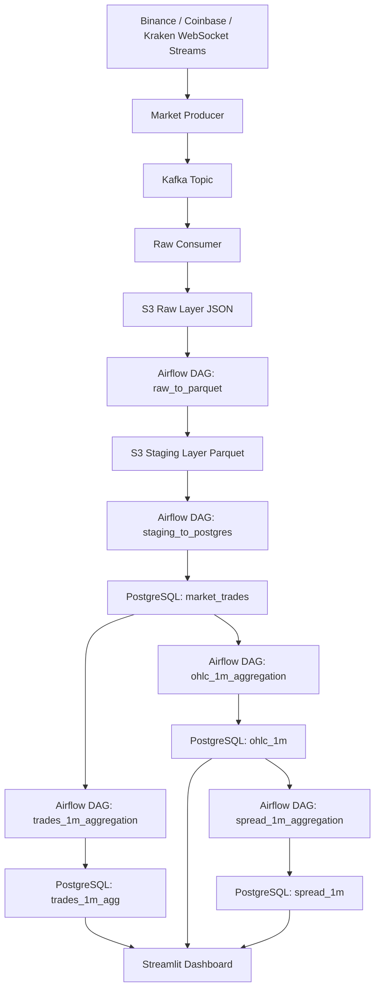
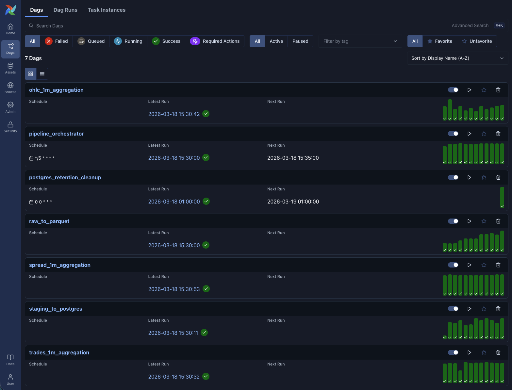
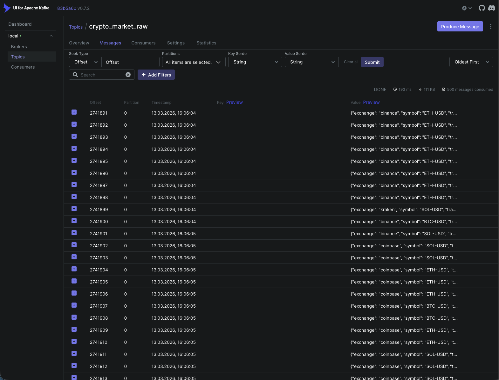
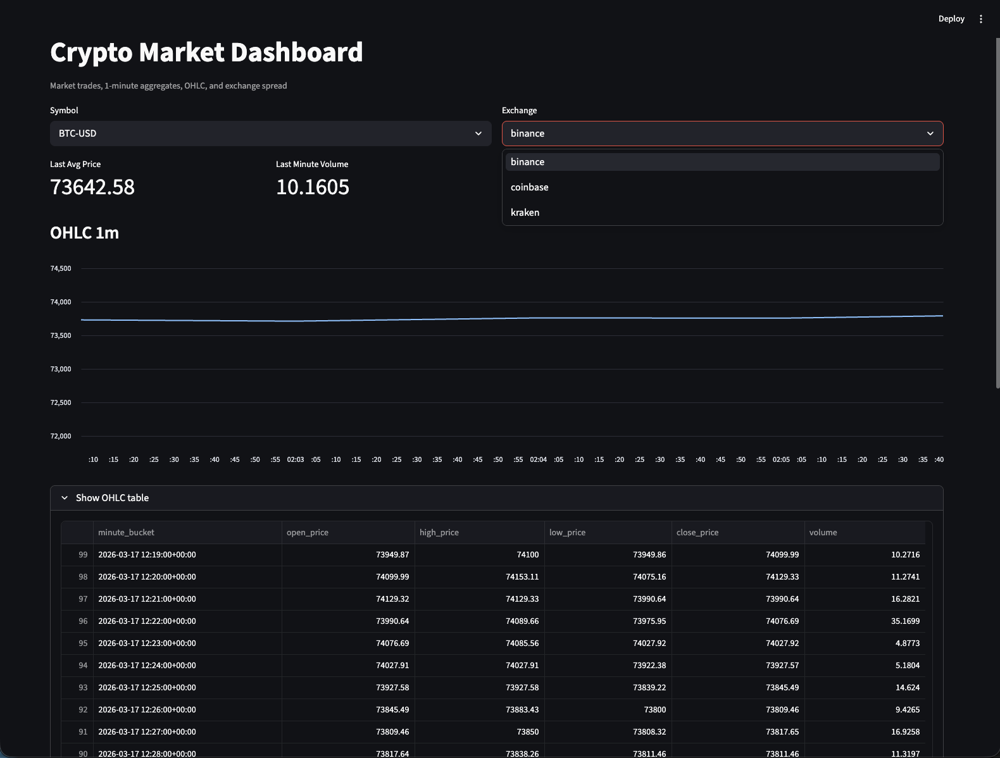
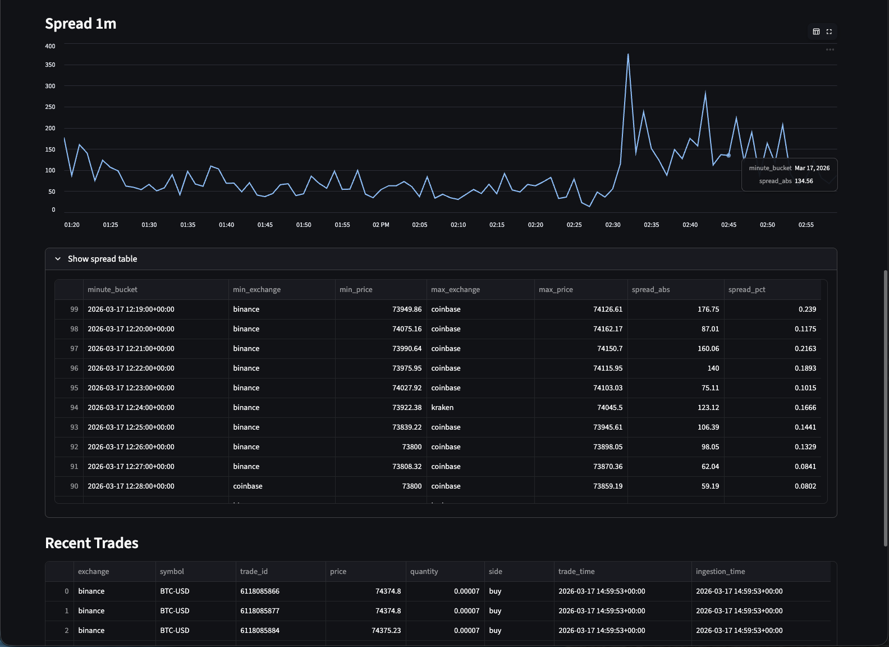

# Real-Time Crypto Market Streaming Platform

Production-like pet project for streaming crypto market data collection, storage, transformation, and analytics.

## Overview

This project ingests real-time trade data from multiple crypto exchanges, sends it through Kafka, persists raw events to
an S3-compatible data lake, converts raw JSON batches into typed Parquet files, loads normalized trades into PostgreSQL,
and builds analytical tables for dashboarding.

At the current stage, the pipeline supports:

- Real-time ingestion from multiple exchanges via WebSocket
- Streaming delivery into Kafka
- Continuous Kafka consumer that writes raw trade batches to S3
- Airflow orchestration for batch transformations
- Raw JSON -> Staging Parquet transformation
- Incremental load from Staging Parquet -> PostgreSQL
- Incremental analytical aggregations in PostgreSQL
- Streamlit dashboard for visualization

## Supported exchanges and symbols

### Exchanges

- Binance
- Coinbase
- Kraken

### Symbols

- BTC-USD
- ETH-USD
- SOL-USD

---

## Architecture



---

## Data flow by layers

### 1. Streaming ingestion layer

Trade events are received from exchange WebSocket streams and normalized into a unified trade schema.

### 2. Kafka transport layer

Normalized events are published to a Kafka topic and act as a streaming buffer between ingestion and storage.

### 3. Raw data lake layer

A continuously running Kafka consumer batches events and writes them into S3-compatible storage as JSON lines files.

Raw path example:

```text
raw/trades/exchange=binance/symbol=BTC-USD/date=2026-03-17/hour=13/1773749454.json
```

### 4. Staging layer

Airflow transforms raw JSON files into typed Parquet files for efficient downstream analytics.

Staging path example:

```text
staging/trades/exchange=binance/symbol=BTC-USD/date=2026-03-17/hour=13/1773749454.parquet
```

### 5. Serving layer

New Parquet files are incrementally loaded into PostgreSQL.

Main normalized table:

- `market_trades`

### 6. Analytics layer

PostgreSQL stores analytical tables built from normalized trades:

- `trades_1m_agg` — 1-minute aggregated trade metrics
- `ohlc_1m` — 1-minute OHLC candles
- `spread_1m` — 1-minute cross-exchange spread metrics

### 7. Visualization layer

A Streamlit dashboard reads analytical PostgreSQL tables and displays charts and tables.

---

## Main services

### Kafka

Used as a real-time transport and buffering layer between ingestion and storage.

### LocalStack S3

Used as a local data lake replacement for AWS S3.

### PostgreSQL

Used as the serving and analytics database.

### Airflow

Used to orchestrate data transformations and incremental analytical jobs.

### Streamlit

Used as the frontend dashboard.

---

## Project structure

```text
crypto-market-streaming-platform/
├── airflow/
│   └── dags/
│       ├── raw_to_parquet_dag.py
│       ├── staging_to_postgres_dag.py
│       ├── trades_1m_agg_dag.py
│       ├── ohlc_1m_dag.py
│       ├── spread_1m_dag.py
│       └── postgres_retention_dag.py
│
├── dashboard/
│   ├── app.py
│   ├── Dockerfile
│   └── requirements.txt
│
├── kafka/
│   └── init/
│       └── create-topics.sh
│
├── localstack/
│   └── init/
│       └── 01-create-bucket.sh
│
├── postgres/
│   └── init/
│       └── 01-create-databases.sh
│
├── src/
│   ├── analytics/
│   │   ├── trades_1m_agg.py
│   │   ├── ohlc_1m.py
│   │   └── spread_1m.py
│   │
│   ├── config/
│   │   └── settings.py
│   │
│   ├── consumers/
│   │   └── raw_to_s3_consumer.py
│   │
│   ├── db/
│   │   ├── ddl.py
│   │   ├── init_db.py
│   │   ├── list_new_staging_files.py
│   │   └── load_one_staging_file.py
│   │
│   ├── producers/
│   │   ├── market_data_producer.py
│   │   ├── kafka_producer.py
│   │   ├── binance_stream.py
│   │   ├── coinbase_stream.py
│   │   └── kraken_stream.py
│   │
│   ├── runners/
│   │   ├── run_producer.py
│   │   ├── run_consumer.py
│   │   └── init_db.py
│   │
│   ├── schemas/
│   │   └── trade_schema.py
│   │
│   └── transforms/
│       ├── list_raw_files.py
│       └── raw_to_parquet.py

│
├── docker-compose.yml
├── Dockerfile
├── requirements.txt
└── .env
```

---

## Core tables

### `market_trades`

Normalized trade-level data loaded incrementally from staging Parquet.

Columns:

- `exchange`
- `symbol`
- `trade_id`
- `price`
- `quantity`
- `side`
- `trade_time`
- `ingestion_time`

Primary key:

- `(exchange, symbol, trade_id)`

### `loaded_staging_files`

Technical table used for incremental loading.

Columns:

- `parquet_key`
- `loaded_at`

### `trades_1m_agg`

1-minute aggregated metrics.

Columns:

- `exchange`
- `symbol`
- `minute_bucket`
- `trade_count`
- `volume`
- `avg_price`
- `min_price`
- `max_price`

### `ohlc_1m`

1-minute OHLC candles.

Columns:

- `exchange`
- `symbol`
- `minute_bucket`
- `open_price`
- `high_price`
- `low_price`
- `close_price`
- `volume`

### `spread_1m`

Cross-exchange spread table.

Columns:

- `symbol`
- `minute_bucket`
- `min_exchange`
- `min_price`
- `max_exchange`
- `max_price`
- `spread_abs`
- `spread_pct`

---

## Incremental processing logic

### Raw -> Staging

- Airflow scans raw files in S3
- Only files without corresponding Parquet output are processed

### Staging -> PostgreSQL

- Airflow scans staging Parquet files
- Already loaded files are tracked in `loaded_staging_files`
- Only new Parquet files are inserted into `market_trades`

### Analytics tables

- Aggregation jobs use incremental window logic
- Previously aggregated recent buckets are deleted and recalculated from the last known bucket
- This prevents duplicates and handles late-arriving events safely

---

## Retention strategy

Kafka is used as a transient streaming buffer and should not be treated as the long-term source of truth.

Long-term history is stored in:

- S3 raw layer
- S3 staging layer

PostgreSQL serves as an analytical/serving layer and should keep only a reasonable retention window.

Current retention DAG cleans:

- `market_trades`
- `trades_1m_agg`
- `ohlc_1m`
- `spread_1m`

---

## Dashboard

The dashboard reads from PostgreSQL and displays:

- latest aggregated metrics
- OHLC chart
- spread chart
- recent trades table

---

## Quick Start

### 1. Setup environment variables

Create `.env` file from the example:

```bash
cp .env.example .env
```

### 2. Start infrastructure

```bash
docker compose up -d --build
```

### 3. Create PostgreSQL tables

If `db-init` is not wired into startup yet, initialize manually:

```bash
docker compose exec airflow-scheduler python src/runners/init_db.py
```

### 4. Open services

- Airflow: `http://localhost:8080`
- Kafka UI: `http://localhost:8081`
- Dashboard: `http://localhost:8501`

---

## What this project demonstrates

This project demonstrates practical skills in:

- streaming ingestion
- Kafka-based event transport
- raw/staging data lake design
- typed Parquet transformations
- incremental loading into PostgreSQL
- incremental analytical aggregations
- Airflow orchestration
- service separation with Docker Compose
- dashboarding on top of analytical tables

---

### Screenshots

#### Airflow



#### Kafka UI



#### Dashboard



